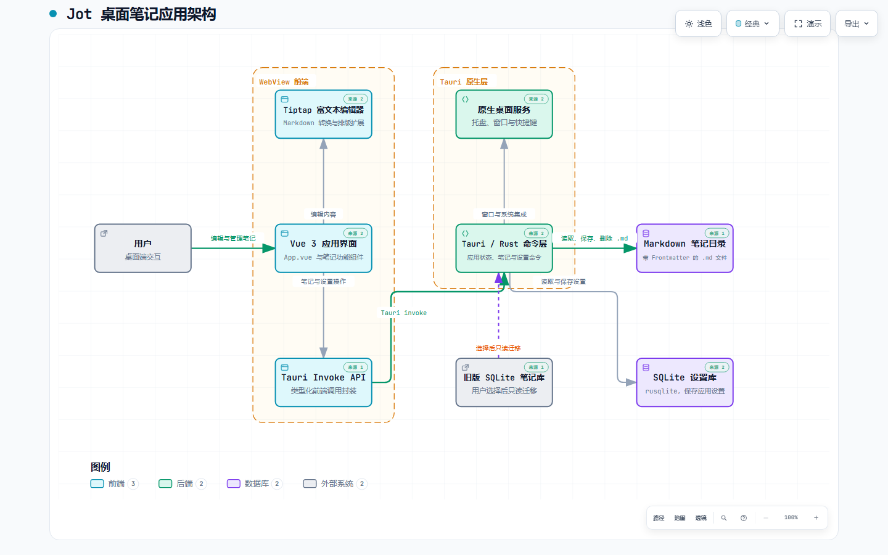
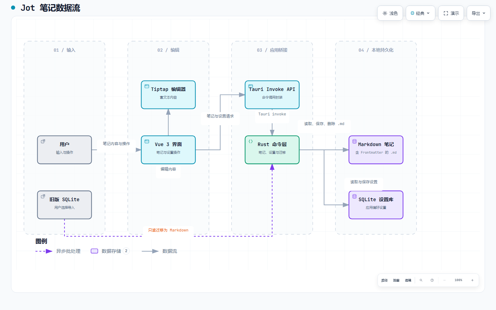
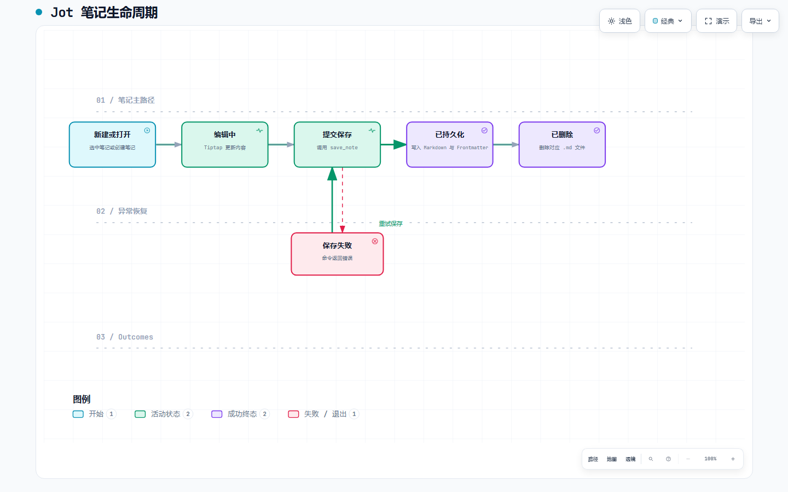

# Jot

<p align="center">
  
</p>

<p align="center">A focused, local-first desktop app for capturing notes, ideas, and tasks.</p>

<p align="center">
  <a href="./README.zh-CN.md">中文文档</a> ·
  <a href="https://github.com/yumkea/jot-rust/releases">Releases</a> ·
  <a href="https://github.com/yumkea/jot-rust/issues">Issues</a> ·
  <a href="./LICENSE">GPL-3.0</a>
</p>

<p align="center">
  
  
  
  
</p>

## Why Jot?

Jot is a compact floating note window for capturing a thought before it disappears. It combines a Vue editor with a Tauri/Rust desktop shell, keeps notes in local Markdown files, and stores only application preferences in SQLite.

- Capture quickly with a global shortcut and a lightweight window.
- Write rich Markdown-friendly notes with Tiptap, tables, task lists, math, and outlines.
- Keep note content portable: each note is a `.md` file with Frontmatter metadata.
- Use native desktop features such as tray controls, window actions, file dialogs, and configurable shortcuts.

<p align="center">
  
  
</p>

## Features

- Fast note creation, search, history, outline navigation, and note settings.
- Rich-text editing powered by Tiptap with Markdown conversion.
- Tables, task lists, KaTeX math, code blocks, and common formatting shortcuts.
- Markdown persistence with `id`, `title`, `created_at`, and `updated_at` Frontmatter.
- Configurable note directory and one-time migration from a legacy SQLite note database.
- Tauri-native tray, window, dialog, and global-shortcut integration.

<p align="center">
  
  
</p>

## Architecture

The project documentation includes checked, interactive diagrams. The PNG previews below render on GitHub; open the linked HTML files locally for theme switching, pan/zoom, search, and relationship tracing.

### System architecture

[Open the interactive architecture diagram](./docs/architecture/jot-rust-architecture.html)

<a href="./docs/architecture/jot-rust-architecture.html">
  
</a>

### Note data flow

[Open the interactive data-flow diagram](./docs/architecture/jot-rust-dataflow.html)

<a href="./docs/architecture/jot-rust-dataflow.html">
  
</a>

### Note lifecycle

[Open the interactive lifecycle diagram](./docs/architecture/jot-rust-note-lifecycle.html)

<a href="./docs/architecture/jot-rust-note-lifecycle.html">
  
</a>

The diagram source specifications live beside the HTML artifacts in [`docs/architecture`](./docs/architecture).

## Note storage

Jot writes notes to a user-configurable directory as Markdown files:

```markdown
---
id: "..."
title: "..."
created_at: 2026-07-02 10:00:00
updated_at: 2026-07-02 10:30:00
---

Your note content...
```

Application settings, such as the selected note directory and shortcut preferences, are stored separately in a local SQLite database. Existing SQLite note databases can be imported into the Markdown directory through the app.

## Getting started

### Prerequisites

- Node.js 20.19+
- npm
- Rust stable
- Platform-specific [Tauri prerequisites](https://v2.tauri.app/start/prerequisites/)

### Development

```bash
git clone git@github.com:yumkea/jot-rust.git
cd jot-rust
npm install
npm run tauri dev
```

To run the Vite frontend only:

```bash
npm run dev
```

The development server runs at `http://localhost:1420`.

## Scripts

```bash
npm run dev          # Start Vite
npm run build        # Type-check and build the frontend
npm test             # Run Vitest
npm run tauri dev    # Start the desktop app in development
npm run tauri build  # Build desktop bundles
```

## Project structure

```text
src/                 Vue UI, editor components, composables, and Tauri API wrapper
src-tauri/           Rust commands, native integrations, storage, and Tauri config
resources/           Application icons and asset-generation helpers
docs/architecture/   Architecture, data-flow, and lifecycle diagrams
```

## Contributing

Issues and pull requests are welcome. Before opening a pull request, please run:

```bash
npm test
npm run build
```

## License

Jot is licensed under the [GNU General Public License v3.0](./LICENSE).
