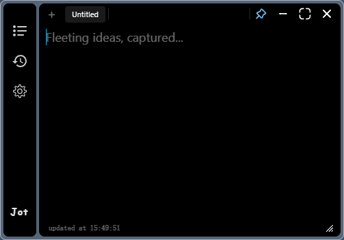
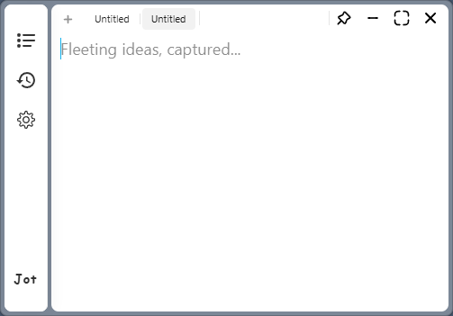
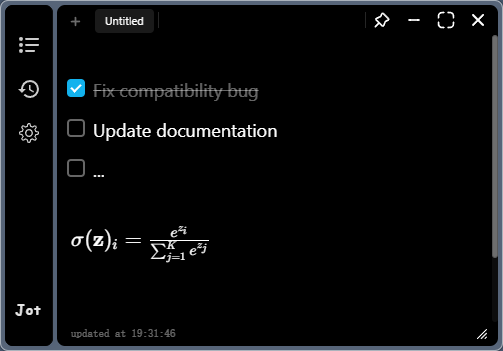
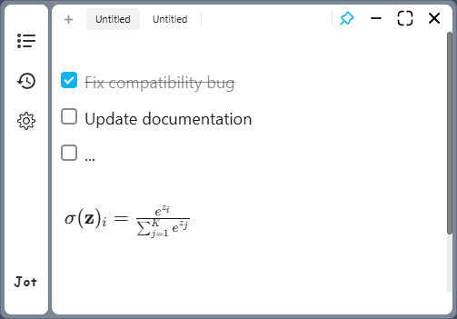
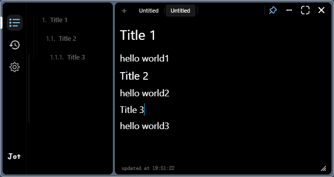
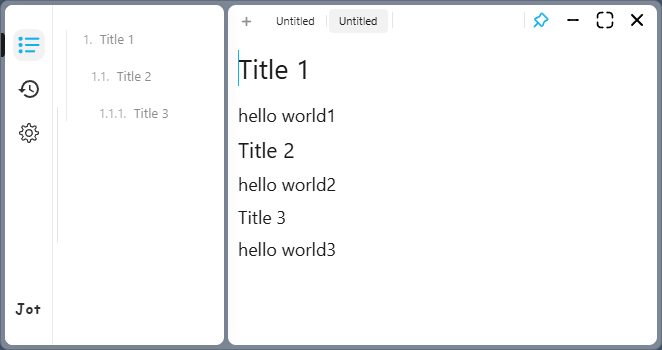

  

  Capture fleeting ideas with a lightweight, elegant desktop note-taking app

  <a href="./README.zh-CN.md">中文文档</a>
  ·
  <a href="https://github.com/yumkea/jot/releases">Releases</a>

  
  

---

## ✨ What is Jot?

Jot is a minimalist floating note-taking application designed to capture your fleeting ideas with zero friction. Press a global hotkey and a beautiful transparent window appears right at your cursor — type your thought, and it's saved automatically.

No switching windows. No opening apps. Just **jot it down**.

  &nbsp;

## 🎯 Features

### ⚡ Quick Capture
- **Global Hotkey** — Press `Ctrl+J` (customizable) anywhere to summon Jot right at your cursor
- **Floating Window** — A beautiful transparent window that stays on top when you need it
- **Auto-Save** — Never worry about losing your thoughts; everything is saved automatically

  

### ✏️ Rich Editor
- **Rich Text Editing** with Markdown-like shortcuts — headings, bold, italic, lists, code blocks
- **LaTeX Math** — Write formulas with familiar `$E=mc^2$` and `$$...$$` syntax
- **Task Lists** — Interactive checkboxes to track your to-dos
- **Tables** — Create and edit tables with an intuitive right-click menu
- **Slash Commands** — Type `/` to quickly insert task lists, tables, and more

  &nbsp;

### 📂 Organization
- **Multi-Tab** — Work on multiple notes at the same time
- **Note History** — Browse all your notes, grouped by date (Today, Yesterday, ...)
- **Document Outline** — Jump to any heading with the auto-numbered outline panel
- **Export** — Save your notes as Markdown or standalone HTML

  &nbsp;

### 🎨 Customization
- **Dark / Light Theme** — Switch between themes with a single click
- **Accent Colors** — Pick your favorite color and the entire UI adapts
- **Configurable Shortcuts** — Remap every shortcut; choose which ones work system-wide
- **Bilingual UI** — Full English and Chinese interface
- **Auto Launch** — Optionally start Jot with your system

### 💻 Desktop Integration
- **System Tray** — Lives quietly in your system tray, always one click away
- **Multi-Monitor** — Works seamlessly across displays with different scaling
- **Close Behavior** — Choose to hide to tray or fully quit when closing

## 📦 Download & Install

Jot is available for **Windows**, **macOS**, and **Linux**.

Download the latest version from [GitHub Releases](https://github.com/yumkea/jot/releases).

Or build from source.

## 🎨 Design Philosophy

Jot is built around the idea that **capturing a thought should take less than 2 seconds**. The design prioritizes:

1. **Minimal Friction** — Global hotkey summons window at cursor; no app switching
2. **Visual Elegance** — Glassmorphic transparent window with smooth animations
3. **Focused Scope** — Note-taking only; no project management, no folders, no tags
4. **Native Feel** — System tray, auto-launch, multi-monitor support

> *"Graceful stories originate in an unplanned jot."*

## ⌨️ Keyboard Shortcuts

| Action | Shortcut |
|--------|----------|
| Show / Hide Jot | `Ctrl+J` |
| New Note | `Ctrl+N` |
| Save Note | `Ctrl+S` |
| Toggle Outline | `Ctrl+Shift+O` |
| Toggle History | `Ctrl+H` |
| Pin on Top | `Ctrl+P` |

All shortcuts are fully customizable — head to **Settings => Shortcuts** to make them your own.

## 📄 License

This project is licensed under the [GNU General Public License v3.0](./LICENSE).

---

  Made with care for those who think faster than they can organize.

